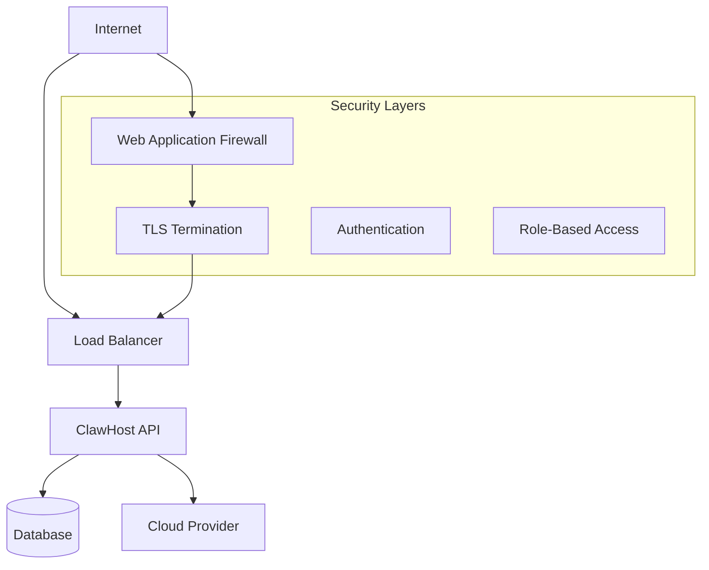

# Security Policy

## Reporting Security Vulnerabilities

The ClawHost team takes security seriously. If you discover a security vulnerability, we appreciate your help in disclosing it to us responsibly.

**Please do not report security vulnerabilities through public GitHub issues.**

### How to Report

**Private Reporting**: Open a private security advisory in this repository (Security tab).

**PGP Key**: Available on request from the security team.

### What to Include

When reporting a security issue, please include:

1. **Type of issue** (e.g., buffer overflow, SQL injection, cross-site scripting, etc.)
2. **Full paths** of source file(s) related to the manifestation of the issue
3. **Location** of the affected source code (tag/branch/commit or direct URL)
4. **Special configuration** required to reproduce the issue
5. **Step-by-step instructions** to reproduce the issue
6. **Proof-of-concept or exploit code** (if possible)
7. **Impact** of the issue, including how an attacker might exploit it

### Response Timeline

- **Initial Response**: Within 24 hours
- **Assessment**: Within 5 business days
- **Fix Development**: Varies based on complexity
- **Public Disclosure**: After fix is released

## Supported Versions

We provide security updates for the following versions:

| Version | Supported          |
| ------- | ------------------ |
| 1.x.x   | ✅ Yes             |
| 0.x.x   | ❌ No (Beta)       |

## Security Best Practices

### For Users

#### API Keys and Secrets
- **Never commit** API keys, tokens, or secrets to version control
- **Use environment variables** for sensitive configuration
- **Rotate keys regularly** (at least every 90 days)
- **Use least-privilege access** for cloud provider keys

#### Network Security
- **Use HTTPS** for all API communications
- **Implement proper firewall rules** on your servers
- **Restrict SSH access** to necessary IP addresses only
- **Use SSH key authentication** instead of passwords

#### Instance Security
- **Keep OpenClaw updated** to the latest version
- **Monitor logs** for suspicious activity
- **Enable automatic security updates** on your servers
- **Use strong passwords** for database and admin accounts

### For Developers

#### Code Security
- **Validate all inputs** from users and external systems
- **Use parameterized queries** to prevent SQL injection
- **Implement proper authentication** and authorization
- **Hash passwords** using bcrypt or similar strong algorithms

#### Infrastructure Security
- **Use TLS 1.2+** for all network communications
- **Implement rate limiting** to prevent abuse
- **Log security events** for monitoring and forensics
- **Use secrets management** systems in production

## Common Vulnerabilities

### Cloud Provider API Keys

**Risk**: Exposed API keys can allow attackers to create/destroy infrastructure

**Mitigation**:
- Store keys in environment variables only
- Use IAM roles when possible
- Implement key rotation
- Monitor API usage

### Database Access

**Risk**: SQL injection or unauthorized database access

**Mitigation**:
- Use GORM's safe query methods
- Implement proper connection string security
- Use database user with minimal necessary permissions
- Enable database auditing

### Server Communication

**Risk**: Man-in-the-middle attacks or eavesdropping

**Mitigation**:
- Always use HTTPS/TLS
- Implement certificate pinning where possible
- Validate SSL certificates
- Use strong cipher suites

## Security Headers

The ClawHost API implements these security headers:

```
Strict-Transport-Security: max-age=31536000; includeSubDomains
X-Content-Type-Options: nosniff
X-Frame-Options: DENY
X-XSS-Protection: 1; mode=block
Content-Security-Policy: default-src 'self'
```

## Compliance

ClawHost follows these security standards:

- **OWASP Top 10** - Web application security risks
- **NIST Cybersecurity Framework** - Risk management
- **SOC 2 Type II** (Commercial service only)
- **ISO 27001** (Commercial service only)

## Security Audits

### Third-Party Audits

- **Annual penetration testing** by certified security firms
- **Code security reviews** for major releases
- **Dependency vulnerability scanning** with automated tools
- **Infrastructure security assessments** quarterly

### Bug Bounty Program

*(Coming Soon)*

We're planning to launch a bug bounty program to reward security researchers who help improve ClawHost's security.

**Scope**: ClawHost core components and hosted infrastructure
**Rewards**: $100 - $5,000 depending on severity
**Timeline**: Q2 2026

## Security Architecture

### Network Diagram



### Data Flow Security

1. **Input Validation**: All user inputs validated and sanitized
2. **Authentication**: JWT tokens for API access
3. **Authorization**: Role-based access control
4. **Encryption**: TLS 1.3 for data in transit
5. **Logging**: All security events logged and monitored

## Incident Response

### Security Incident Procedure

1. **Detection**: Automated monitoring or manual report
2. **Assessment**: Severity evaluation within 2 hours
3. **Containment**: Immediate steps to limit damage
4. **Investigation**: Root cause analysis
5. **Remediation**: Fix implementation and testing
6. **Communication**: User notification if needed
7. **Post-Incident**: Review and process improvement

### Severity Levels

- **Critical**: Active exploitation, data breach
- **High**: Potential for significant damage
- **Medium**: Limited impact, requires attention
- **Low**: Minor security concerns

## Security Tools

### Static Analysis
- **gosec**: Go security analyzer
- **semgrep**: Code pattern matching
- **CodeQL**: GitHub's security scanning

### Dependency Scanning
- **Dependabot**: Automated dependency updates
- **Snyk**: Vulnerability scanning
- **OWASP Dependency Check**: Known vulnerabilities

### Runtime Protection
- **Rate limiting**: Prevent abuse
- **WAF rules**: Filter malicious requests
- **Monitoring**: Real-time threat detection

## Contact Information

- **Security Team**: GitHub Security Advisories (private report)
- **General Contact**: hello@clawhost.com
- **Emergency**: +1-555-SECURITY (24/7)

---

*This security policy is reviewed quarterly and updated as needed.*

**Last Updated**: March 2026
**Next Review**: June 2026